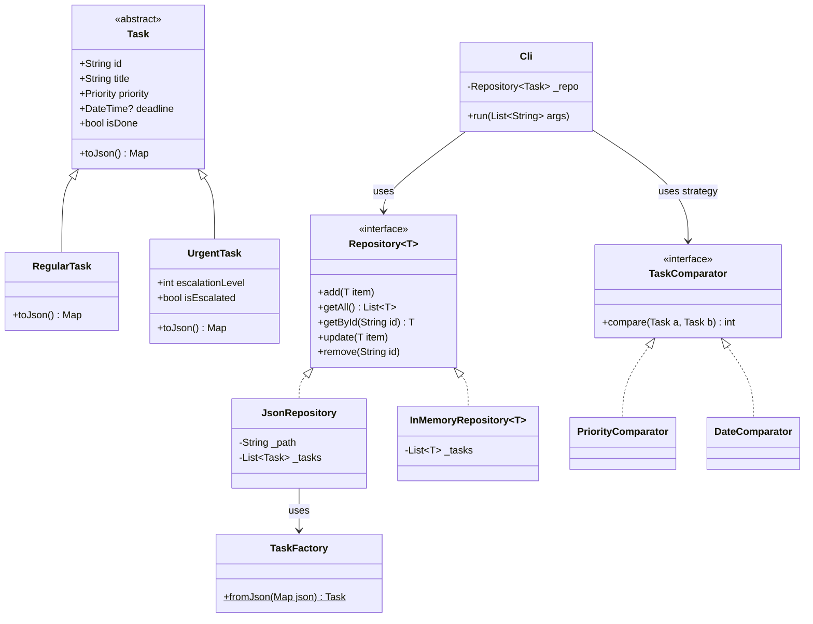

# CLI Task Manager

A command-line task manager written in pure Dart, designed to demonstrate object-oriented programming (OOP) best practices, SOLID principles, and clean architecture.

## Features

- Add tasks with title, priority (low/medium/high), and optional deadline
- List tasks sorted by priority or deadline
- Mark tasks as done
- Delete tasks
- JSON file persistence (with swappable in-memory storage for tests)
- Urgent task escalation support

## Requirements

- Dart SDK >= 3.9.2

## Setup

```bash
dart pub get
```

## Usage

```bash
# Add a task
dart run bin/main.dart add "Buy groceries" -p high -d 2026-12-31

# Add an urgent task with escalation level
dart run bin/main.dart add "Fix production bug" -p high -u 2

# List all tasks (default: sorted by priority)
dart run bin/main.dart list
dart run bin/main.dart list -s date

# Mark a task as done
dart run bin/main.dart done <task-id>

# Delete a task
dart run bin/main.dart delete <task-id>
```

### Task Types

- **RegularTask** — standard task with title, priority, and optional deadline
- **UrgentTask** — extends RegularTask with an `escalationLevel` (1–5). Tasks with level > 1 are marked `[ESCALATED]` in list output

### Sorting

- `list -s priority` (default) — high first, then by deadline, then alphabetically
- `list -s date` — earliest deadline first, undated tasks last

## Architecture and SOLID Principles

This project employs a clean, layered architecture and enforces SOLID principles:



### Design Rationale:
- **Single Responsibility (SRP):** `Task` is purely a data contract. Deserialization is handled by `TaskFactory`, and sorting is extracted to `TaskComparator` strategies.
- **Open/Closed (OCP):** New sorting behaviors can be added by creating new `TaskComparator` implementations without touching existing code.
- **Liskov Substitution (LSP):** The `Cli` relies strictly on the `Repository<Task>` interface; both `JsonRepository` and `InMemoryRepository` are fully substitutable.
- **Interface Segregation (ISP):** The `Repository<T>` utilizes Dart 3's `interface class` keyword to expose only essential CRUD operations.
- **Dependency Inversion (DIP):** High-level modules (`Cli`) depend on abstractions (`Repository<Task>`), not on concrete details (like `JsonRepository`).

## Running Tests

```bash
dart test
```

The test suite contains 15 tests covering repository CRUD, serialization round-trips, priority sorting (using `InMemoryRepository` to avoid disk I/O), exception paths, and urgent task escalation behavior.
